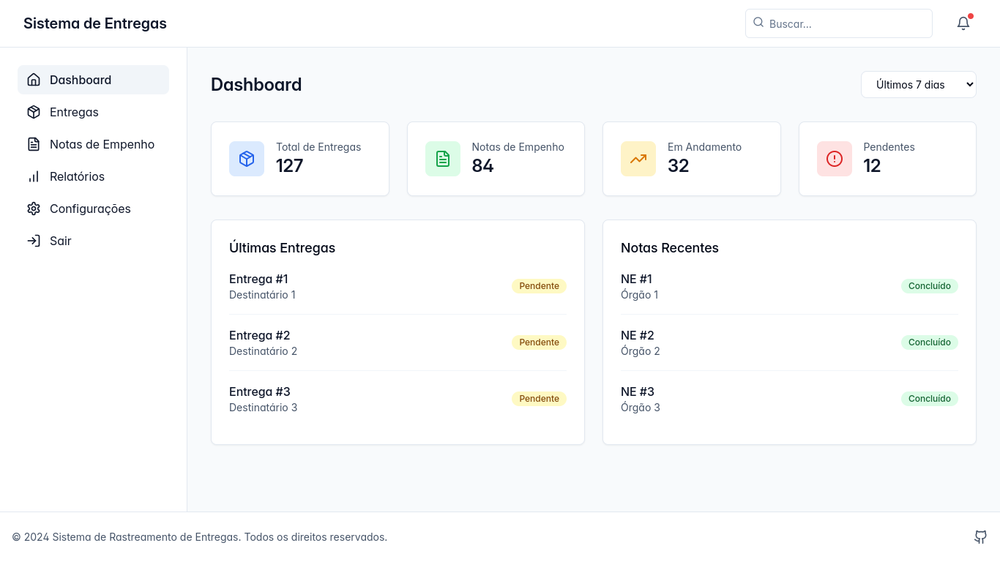
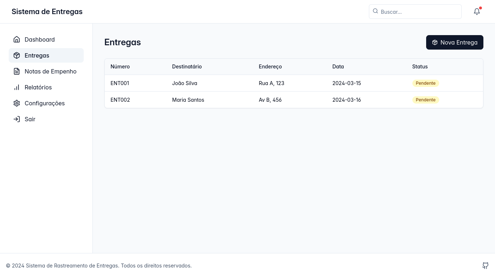
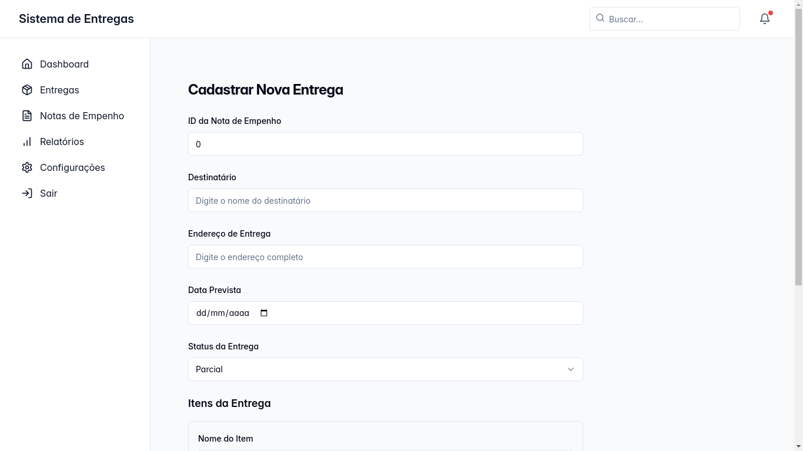
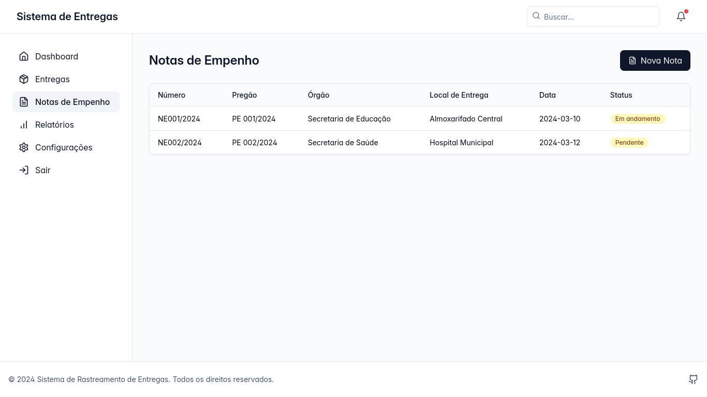
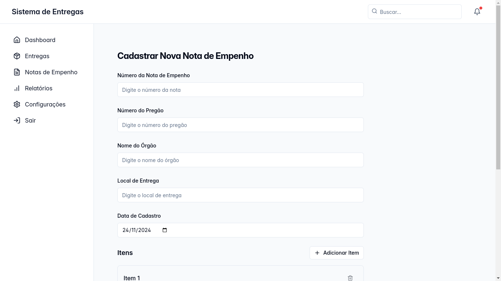
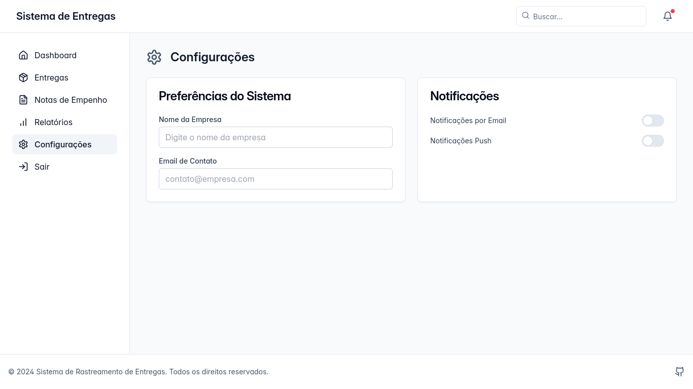

# Sistema de Gestão e controle de Notas de Empenho e Entregas

## 📋 Sobre o Projeto
Sistema web para gerenciamento e rastreamento de entregas e notas de empenho, desenvolvido com React e TypeScript.

## 📸 Screenshots

### Dashboard

Página inicial com visão geral das métricas e indicadores principais.

### Entregas

Listagem e gerenciamento de todas as entregas.

### Cadastro de Entrega

Formulário para registro de novas entregas.

### Notas de Empenho

Controle e visualização das notas de empenho.

### Cadastro de Nota de Empenho

Formulário para registro de novas notas de empenho.

### Relatórios

Geração de relatórios personalizados com gráficos e métricas.

### Configurações

Página de configurações do sistema.

### Login

Tela de autenticação do sistema.

## 🚀 Funcionalidades Principais
- Cadastro e gerenciamento de entregas
- Controle de notas de empenho
- Geração de relatórios
- Dashboard com métricas e indicadores
- Sistema de autenticação

## 🛠️ Tecnologias Utilizadas
- React
- TypeScript
- Tailwind CSS
- Shadcn/UI
- React Query
- React Router
- Recharts (para gráficos)
- Date-fns
- jsPDF (para geração de relatórios)

## ⚙️ Pré-requisitos
- Node.js (versão 16 ou superior)
- npm ou yarn

## 🔧 Instalação
1. Clone o repositório
```bash
git clone [url-do-repositorio]
```

2. Instale as dependências
```bash
npm install
# ou
yarn install
```

3. Inicie o servidor de desenvolvimento
```bash
npm run dev
# ou
yarn dev
```

## 📱 Páginas Principais
- **Dashboard**: Visão geral com métricas e gráficos
- **Entregas**: Gerenciamento de entregas
- **Notas de Empenho**: Controle de notas de empenho
- **Relatórios**: Geração de relatórios personalizados
- **Configurações**: Configurações do sistema

## 🔐 Autenticação
O sistema possui um sistema de autenticação integrado para garantir a segurança dos dados.

## 📊 Relatórios
- Geração de relatórios em PDF
- Filtros por período
- Opção de selecionar entre relatórios de entregas ou notas de empenho

## 🎨 Interface
- Design responsivo
- Tema claro/escuro
- Componentes reutilizáveis
- Interface intuitiva e moderna

## 📫 Contribuição
1. Faça um fork do projeto
2. Crie uma branch para sua feature (`git checkout -b feature/AmazingFeature`)
3. Commit suas mudanças (`git commit -m 'Add some AmazingFeature'`)
4. Push para a branch (`git push origin feature/AmazingFeature`)
5. Abra um Pull Request

## 📝 Licença
Este projeto está sob a licença MIT. Veja o arquivo [LICENSE](LICENSE) para mais detalhes.

## 👥 Autores
- Alex Lopes - Desenvolvedor Principal

## 📞 Suporte
Para suporte, envie um email para alexlpsmb@gmail.com
